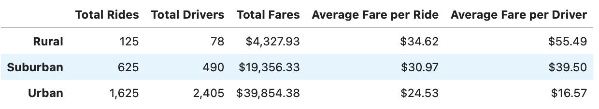

# PyBer_Analysis

## Overview of PyBer_Analysis

An analysis of ride-sharing data is being performed for cities in rural, suburban, and urban areas. The goal is to create a visualization displaying the relationship of the total weekly fares for each type of city, contrast the data between them, and provide decision-makers with recommendations from any disparities observed among them.

## Results

### PyBer Data Summary by City Type

* As rides increase in presumably more densily populated areas, the average fares decrease, but the overall total fares increases.

* Total number of rides is greater than the total number of drivers for rural and suburban cities while the opposite is true for urban cities.

### Total Fares by City Type Timeline

* Over the first four months of 2019, total fares increase with some volatility approaching 02/24/2019 to their peak (near peak for rural cities). The week ending 3/3/2019, total fares drop sharply. 

* The following five weeks towards 04/07/2019, suburban and rural cities' fares remain fairly stable with no significant volatility while urban cities had abrupt changes week-to-week.

* Folowing 4/07/2019, urban and rural fares remained fairly stable with a slight decrease. Suburban fares had a sharp dip with an even steeper increase for an extended period.

## Summary

* Decision-makers should research if there's an opportunity to increase total fares collected for rural and suburban areas by increasing the total number of drivers to the point that it exceeds the total number of rides to match the same rides-to-drivers relationship that exists for urban cities. This may rule out the possibility that ride-sharing may not be as accessible as it needs to be to maximize total fares in rural/suburban cities and that demand is satisfied.

* Explore if there is a relationship with the previous suggestion and the observations that can made with the increases/decreases of fares each week with the multiple-line chart. It's possible that demand for ride-sharing may be present, but the number of driver's needed during those periods with dips to satisfy said demand.
    * While periods of volatility are of interest, periods when the fares for a city type deviates from from the trends of the others such as in April with fares for suburban vs rural/urban cities.

* Depending on the observations made when considering the prior suggestions, marketing pay incentives for drivers and/or reduced fares for riders during historically low fare periods may assist with leveling out any volatility in total fares that is measured of a significant period. 
    * If the driver count seems to be too high, consider a rewards program or reduced costs for riders.
    * If the driver count seems to be too low, also consider a pay incentives for number of rides completed or a bonus-per-ride for drivers.